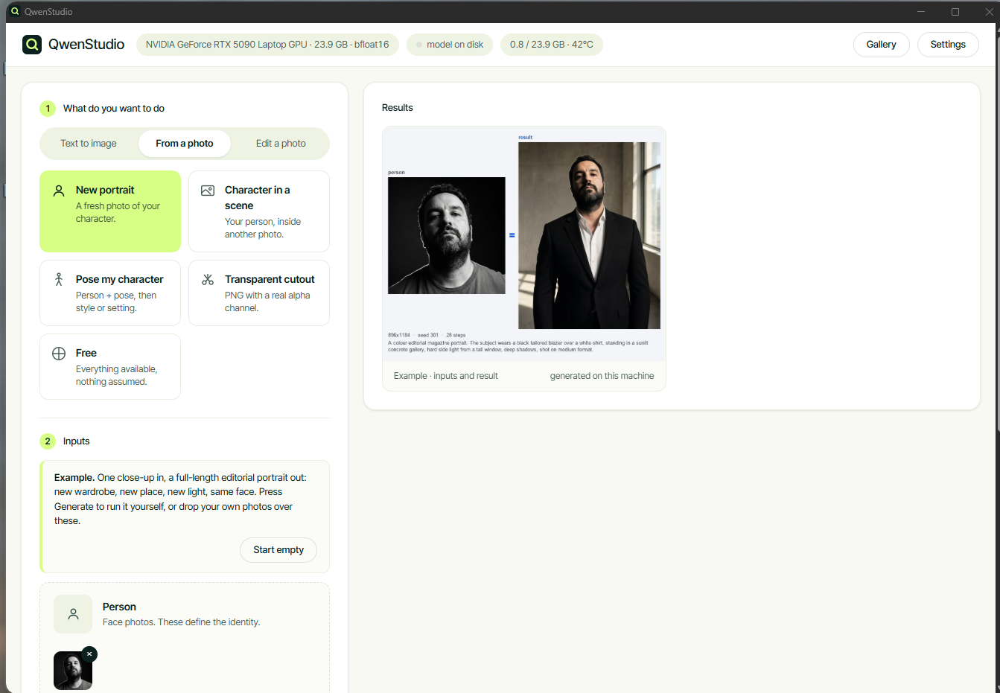
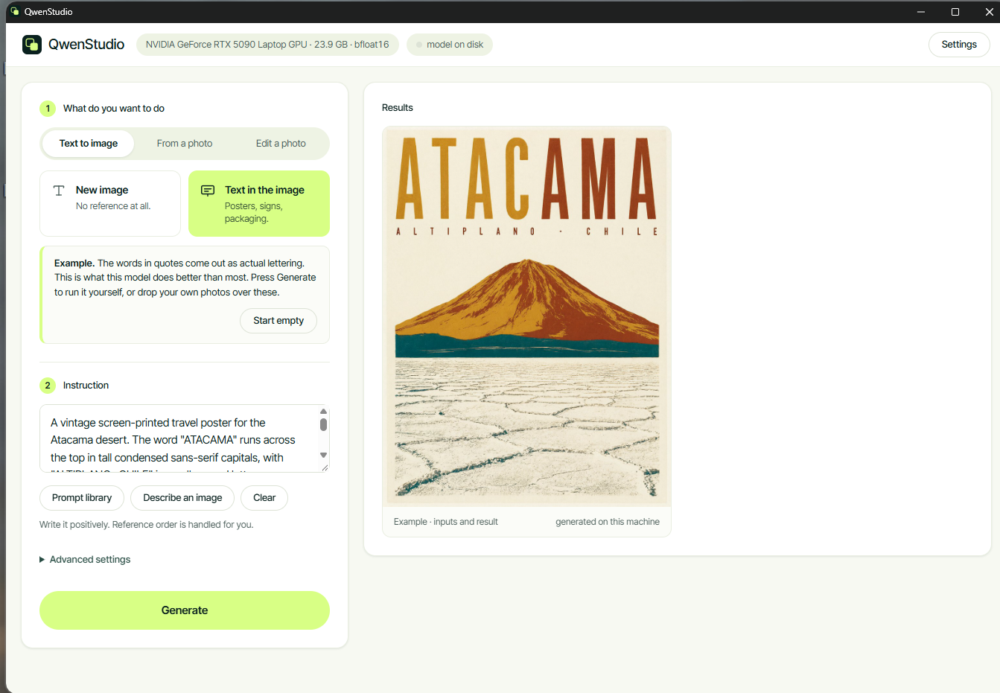
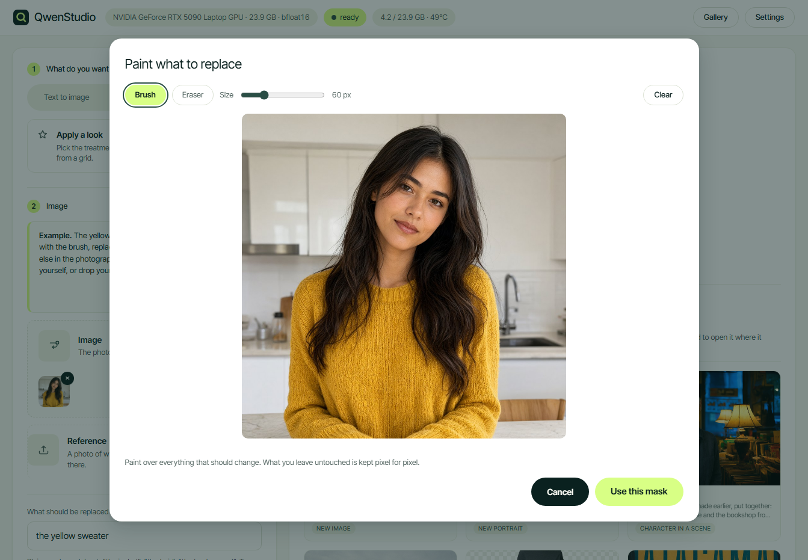
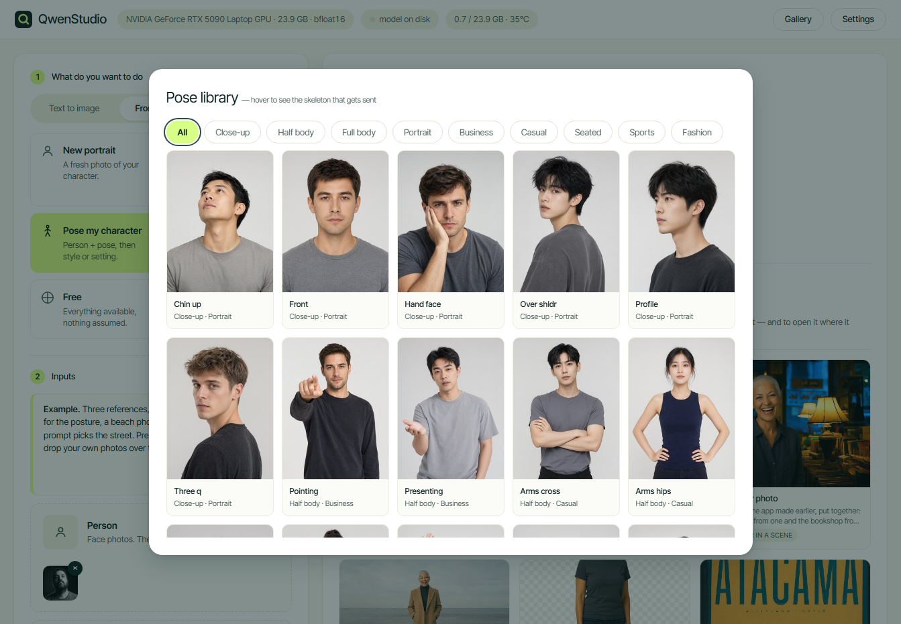
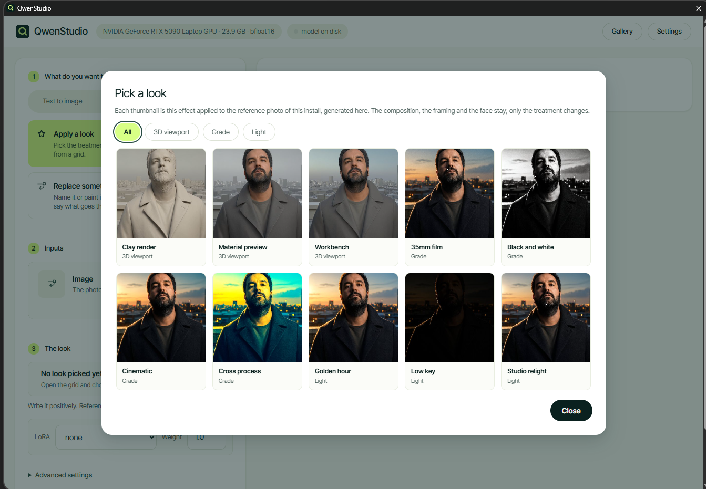
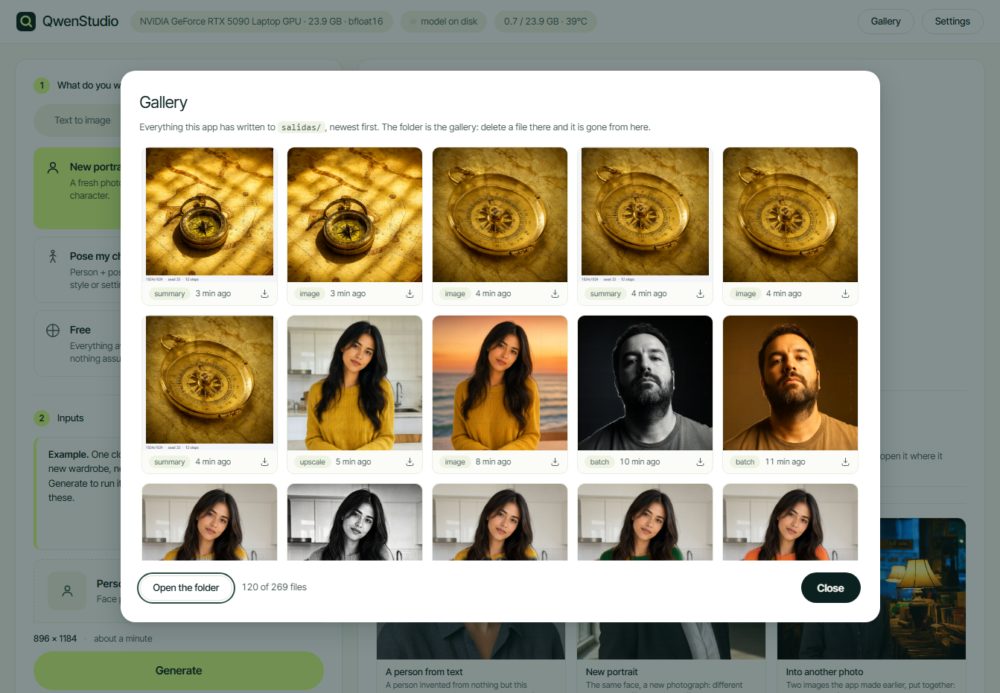
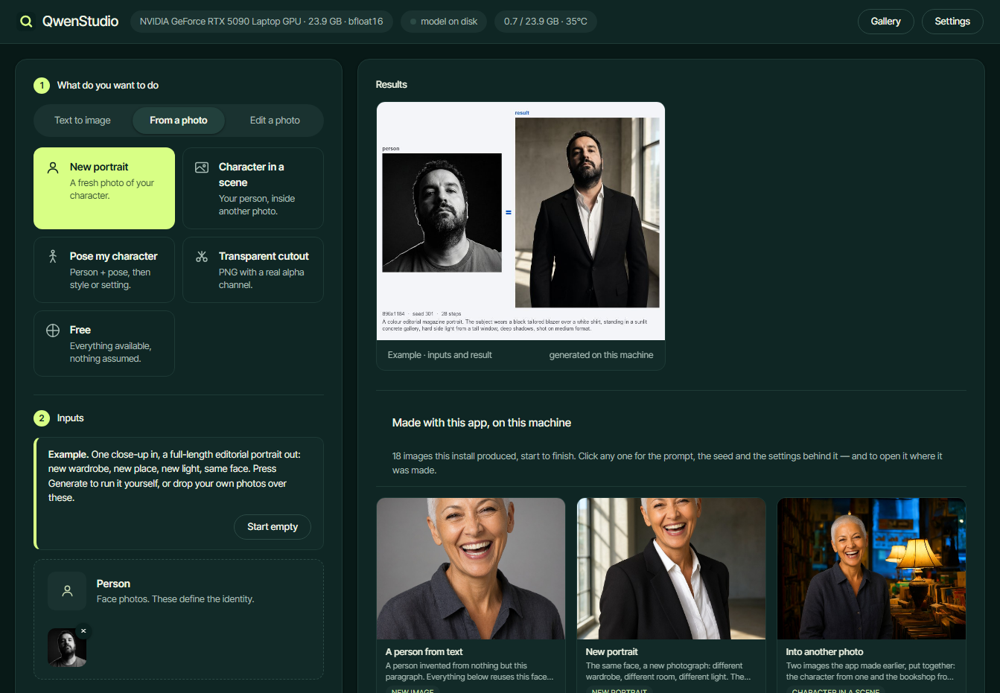
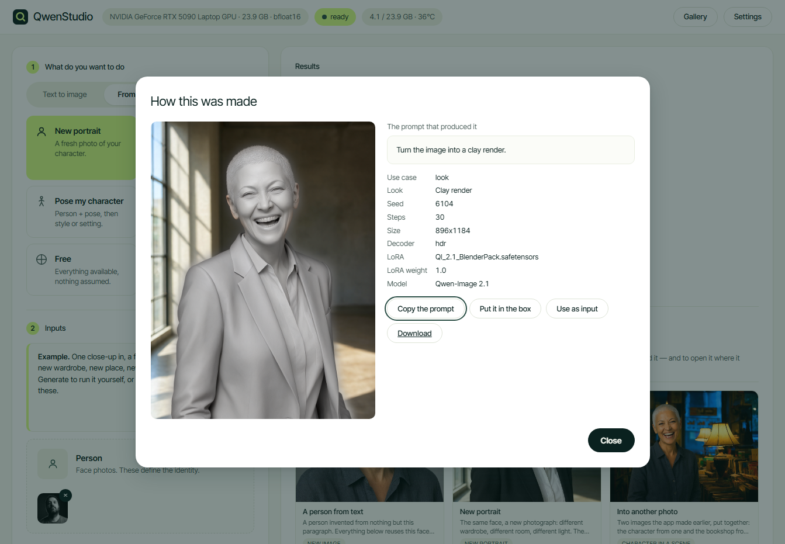
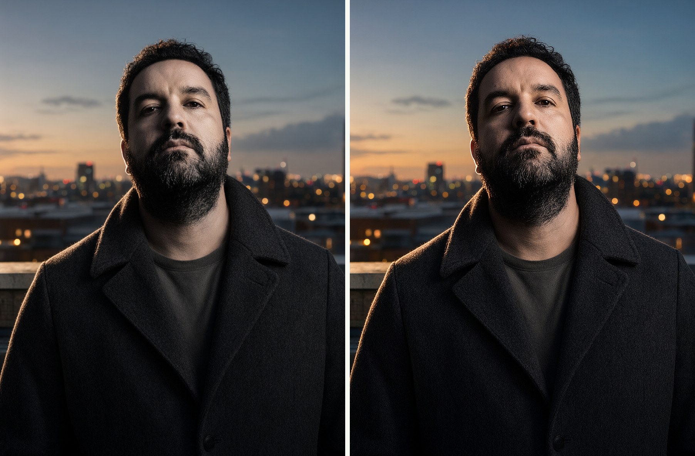

<p align="center">
  
</p>

<h1 align="center">QwenStudio</h1>

<p align="center">
  Local image generation and editing with Qwen-Image 2.1.<br>
  No ComfyUI, no cloud, no account, no API key.
</p>

---

> ### This is an exploration, not a product
>
> It was built to answer a question — *how far does an open image model get you
> when you run it entirely on your own machine?* — and the answer is written
> down here, measurements and failures included.
>
> **It is not an official Superside tool, it is not affiliated with or endorsed
> by Superside, and it is not endorsed by the Qwen team or Alibaba.** The
> interface borrows Superside's palette and typeface because the exploration
> happened there and it needed to look like something; the mark in the corner
> is an original symbol drawn for this repository, not the Superside logo.
>
> **Qwen-Image 2.1 is published under the Qwen Research License: personal and
> research use only.** Nothing produced with this belongs in client work
> without a separate licence from Alibaba. Inter Tight is bundled under the
> SIL Open Font License; CLIPSeg is MIT. See [Licences](#licences).

---

## Two ways to use it

**1. By hand.** Double-click, a page opens at `127.0.0.1:7860`, you drop
photos into boxes and press Generate. Nine use cases in three groups, each
showing only the inputs it needs, each opening with a worked example already
loaded.

**2. By agent.** Point Claude Code, Codex or any MCP client at this folder and
ask for what you want. The agent gets ten tools — generate, edit, describe,
batch, pose library, prompt library — and drives the same engine the interface
drives. The model loads once and both share it, so you can have the page open
while an agent works through a list of prompts in the background.

The second way is the one worth understanding: everything the interface can do
is an HTTP endpoint, and everything an agent needs is a thin layer over those
endpoints. The app is not a wrapper around a script — it is a local service
with two front doors.

---

## Install

```bash
git clone https://github.com/aaronamortegui-glitch/superside_qwen_beta.git QwenStudio
cd QwenStudio
```

Then double-click the installer for your platform:

| | install | run |
|---|---|---|
| **Windows** | `INSTALL.bat` | `RUN.bat` |
| **macOS** | `install.command` | `./run.command` |

The installer downloads **uv**, which brings its own Python 3.12 into this
folder. Nothing on your system is touched: no system Python, no global
packages, no PATH changes. Delete the folder and it is gone.

It detects your hardware **before** installing anything and picks the profile
from it — which PyTorch wheel, which dtype, whether to quantise, how much to
offload, what resolution to cap at. The model weights (~31 GB) download on the
first run, with a resumable progress bar, so you can look at the detected
profile before committing the disk.

`SHORTCUT.bat` (Windows) puts a desktop shortcut with the icon on your desktop.

---

## What it looks like

<p align="center"></p>

Every use case opens with a **worked example**: the inputs it takes, already in
their boxes, and the contact sheet of a real run with exactly those inputs. The
first screen shows *this + this = this* instead of an empty form. Drop your own
photo over any box and the example steps aside.

<p align="center"></p>

Words in quotes come out as **actual lettering**. This is the thing Qwen-Image
does better than almost anything else you can run locally, and the poster above
was generated on the machine described below, at 35 steps, first try.

<p align="center"></p>

An edit selects its region from **words** or from a **brush**. Painting happens
at the photo's real resolution; what you leave untouched comes back byte for
byte, which the test suite checks rather than assumes.

<p align="center"></p>

Thirty poses. The thumbnail is the photo, because that is what you recognise;
hover and it swaps to the OpenPose skeleton, because that is what the model
actually receives.

<p align="center"></p>

Looks are picked from a grid, not typed. Every thumbnail is that effect applied
to this install's own reference photo, generated here — so the grid shows this
model doing this thing, not a screenshot of someone else's pipeline.

<p align="center"></p>

**Everything you make lands in `salidas/`** and the Gallery reads that folder
directly — there is no database to fall out of sync with the disk. Delete a
file there and it is gone from here. Every tile and every result carries a
download button, and **Open the folder** hands you to the file manager.

Each tile also has a × that moves the file to `salidas/_papelera/` rather than
unlinking it. A grid of thumbnails that look alike is exactly where a click you
cannot undo loses the good one; the bin stays on disk and emptying it is your
call, not the app's.

<p align="center"></p>

Light by default, dark in Settings, or Auto to follow the system.

---

## What it does

| Group | Use case | Inputs |
|---|---|---|
| **Text to image** | New image | nothing but the prompt |
| | Text in the image | words in quotes come out as lettering |
| **From a photo** | New portrait | person photos |
| | Character in a scene | person + a photo of the setting |
| | Pose my character | person + pose + optional style and setting |
| | Transparent cutout | person → PNG with a real alpha channel |
| | Free | everything, nothing assumed |
| **Edit a photo** | Apply a look | image + a treatment picked from a grid |
| | Replace something | image + a selection + what goes there |

Plus a **pose library** (30 skeletons across close-up, half and full body), a
**prompt library** (additive snippets, one clause of a photograph each, built
to stack), **image description and reasoning** with Qwen3-VL, **LoRA** loading,
the seven official aspect ratios, 2K native output, a **before/after slider**
on every edit, and a **contact sheet** per run showing inputs + result.

On a machine that cannot run this usefully, the installer and the app both say
so plainly — with a puppy — and then let you through anyway.

---

## How this differs from a closed model

Not "better". Different in ways that decide whether it fits what you are doing.

| | QwenStudio, locally | A hosted closed model |
|---|---|---|
| **Where the image goes** | nowhere. No upload, no retention, no terms about your inputs | to a server, under whatever the terms say today |
| **Cost per image** | electricity | per call, forever |
| **Works offline** | yes, once the weights are down | no |
| **The prompt you sent** | exactly what you wrote, plus scaffolding you can read in `motor.py` | rewritten by a layer you cannot see |
| **Refusals** | none of its own | a moderation policy that changes without notice |
| **Reproducibility** | same seed, same weights, same image, in a year | the model is swapped underneath you |
| **Identity from a photo** | reference images, no training run | usually not offered at all |
| **Speed** | ~55 s for 1024px on a 24 GB laptop GPU | seconds |
| **Peak quality** | very good | usually better |
| **Licence to sell the output** | **no** — Qwen Research License | usually yes |

The honest summary: a closed model is faster, often prettier, and legally
simpler to sell. This is private, free to run, reproducible, inspectable, and
yours — and the prompt scaffolding that makes identity transfer work is written
in a file you can open and argue with.

That last point is the interesting one. Every rule the app applies was measured
rather than assumed, and the ones that surprised us are in **Things worth
knowing** below. A closed model gives you a result; this gives you a result and
the reason.

---

## The four reference slots

Each does exactly one job, so they compose without fighting:

| slot | gives | stays out of it |
|---|---|---|
| **Person** | the face and identity | everything else |
| **Pose** | posture, limbs, head tilt | build and height — those stay the person's |
| **Style** | grade, contrast, grain, quality of light | its subject, setting and composition |
| **Scene** | place, wardrobe, framing, lighting | the face |

The prompt is assembled from whichever slots you filled: no pose, no skeleton
clause. Every reference is tagged `<image1>`, `<image2>`… and the tag is
repeated inside its own instruction, because the text encoder reserves one
vision slot per tag and that binding is what keeps them apart.

The order is not yours to choose, and that is deliberate — see below.

---

## Things worth knowing

Everything here was measured in one long session on the hardware listed further
down. Where a belief turned out to be wrong, the wrong version is left in.

**Reference order decides everything.** Identity transfers when the person is
`<image1>`; with the scene first the scene dominates and the face does not
change at all. It fails *silently*, producing a plausible image that is simply
the wrong person. The app always orders person → pose → style → scene, and
`refs` and the `<imageN>` numbering are built in the same function so they
cannot drift apart. Every response carries an `orden` field naming which slot
got which tag.

**A scene with a person in it will hand you that person.** The identity clause
sits at the start of the prompt and the scene reference, closer to the end,
outranks it: with a female scene and a male reference, the result came back as
the woman from the scene — right size, right light, wrong human. The fix is
recency: the prompt now repeats, *after* the scene clause, that the one person
in the result is the subject from `<image1>`. Same seed, same inputs, correct
face.

**With a scene, use one photo of the person.** Several photos of the same
person are read as several *different* people, and you get several people in
the frame.

**Prompts go positive but imperative.** There is no negative guidance at
cfg 1, so "ignore the background" just injects the concept. But softening the
verb breaks it too: "the face is hers" does not transfer, "the subject's face
must match `<image1>` exactly" does. The scaffolding says "the subject" rather
than he or she — a pronoun that disagrees with the reference photo is one more
thing for the model to resolve, and it does not always resolve it your way.

**A reference is ignored unless the prompt names what to take from it.** With a
scene loaded and a neutral prompt, the scene contributed *nothing* — the
scaffolding clause alone was not enough. The app now describes the scene with
Qwen3-VL and appends that description, which is what makes the path work.

**"Replace X" is read as "add X on top of X".** Asking for a denim jacket over
the mask of a yellow sweater returned the jacket *open*, with the sweater
underneath. The mask had room for both and the model used it. Saying the
garment is closed and that nothing is visible underneath is what turns a layer
into a replacement.

**int8 quantisation was counterproductive.** The hypothesis was that it would
save memory. Measured: 2.8 s/step and 24.1 GB peak, against 1.26 s/step and
21.2 GB unquantised — bitsandbytes int8 casts bf16↔fp16 on every matmul. It is
not in the profile ladder at all; nf4 only appears below 16 GB, where the
transformer genuinely does not fit.

**Describing an image costs no extra download.** The image model's text encoder
*is* Qwen3-VL-8B, and the checkpoint on disk carries the vision tower and the
language head. The same 16 GB serve both jobs; it loads in 4-bit so it can sit
beside the DiT.

**You cannot burn the card with this, and the app says so.** The thermal limit
is enforced by the firmware, below the driver: around 83–88 °C it clocks itself
down and near 95 °C it cuts out, and nothing in user space overrides that. What
does happen is a laptop sitting at 85 °C for two hours on a fifty-image batch,
throttling the whole way and taking twice as long while nobody understands why.
So the meter shows the temperature, says when the card is throttling, and a
setting makes a batch wait between images until it drops below a threshold —
80 °C by default, 0 to turn it off. That is not damage protection. It is the
difference between a long run finishing and a long run crawling.

**Close anything else using the GPU first.** Starting with VRAM half full makes
generation crawl with no error at all: utilisation reads 100%, power draw stays
low, nothing finishes. Half an hour was lost to a forgotten ComfyUI process
before the app learned to warn about it — and then a second time, mid-build,
which is why the header now carries a **VRAM meter** reading `18.2 / 23.9 GB`
and naming how much of that belongs to something else. Click it and the app
unmounts its models and hands the memory back, no restart. When the number is
someone else's, the meter says so, because then the fix is not here.

---

## Measured here (RTX 5090 Laptop, 24 GB)

| | |
|---|---|
| 1024 px, 25 steps, warm | **55 s** |
| VRAM peak | 21.3 GB |
| model load (first call) | 27–35 s |
| segmentation, 3 phrases | 0.9 s |
| describe an image (Qwen3-VL 4-bit) | 5–9 s, 7.1 GB |

### How long a generation takes, by card

Only the first row was measured. The rest follow from the profile the hardware
detection picks, and the profile is the thing that decides the answer: what
dominates is not raw compute but whether the weights fit, because sequential
offload moves layers across PCIe on every step.

| Your GPU | Profile | What it does | 1024 px, 25 steps |
|---|---|---|---|
| RTX 5090 / 4090 laptop, 24 GB | L | bf16, text encoder offloaded after encoding | **55 s** *(measured)* |
| RTX 5090 / 6000 Ada, 32–48 GB | XL | bf16, nothing offloaded | ~35–45 s *(estimated)* |
| RTX 4080 / 3090, 16–20 GB | M | bf16, sequential offload | ~2–4 min *(estimated)* |
| RTX 4070 / 3080, 10–16 GB | S | nf4 quantised, sequential offload | ~4–8 min *(estimated)* |
| under 10 GB | MINIMO | nf4, everything offloaded | ~10 min+, and the puppy |
| Apple Silicon, 32 GB+ | M | bf16 on MPS, sequential offload | unmeasured — see below |
| no compatible GPU | INVIABLE | CPU | over half an hour per image |

The estimates are extrapolations from one card, not benchmarks, and they are
labelled that way on purpose. The jump between L and M is the one that hurts:
20 GB keeps the transformer resident, 16 GB does not, and everything below that
line pays the PCIe tax on every step of every image.

Other operations on the measured card: an edit or a look runs 45–65 s, the
first model load costs 27–35 s once, segmentation is under a second, and
describing an image with Qwen3-VL takes 5–9 s.

---

Three load configurations were compared. Keeping the transformer and the text
encoder both resident — even with the text encoder in 4-bit — does **not** fit
in 24 GB: weights alone reach 20.8 GB and activations push it into thrashing.
The default (bf16 + model offload) is the fastest of the three on this card.

**ComfyUI is still ~4× faster for the same image.** It uses `int8_convrot`
weights with kernels built for them, a much better memory manager, and — per
[Comfy-Org/ComfyUI#16400](https://github.com/Comfy-Org/ComfyUI/pull/16400), the
PR that added Qwen-Image 2.1 support — prefix caching of text and reference
tokens, worth about 1.7× on edits on its own. That PR does not affect this
project's correctness (we go through diffusers, not ComfyUI), but it names the
optimisation diffusers does not do. If raw speed matters more than being
self-contained, use ComfyUI.

---

## Control it from an agent

```json
{"mcpServers": {"qwenstudio": {
  "command": "D:\\QwenStudio\\.venv\\Scripts\\python.exe",
  "args": ["-m", "qwenstudio.mcp_server"],
  "cwd": "D:\\QwenStudio"}}}
```

On macOS the command is `.venv/bin/python` and `cwd` is wherever you cloned it.

Ten tools: `status`, `list_poses`, `list_loras`, `prompt_library`,
`describe_image`, `generate`, `generate_batch`, `preview_selection`, `inpaint`,
`unmount`.

`inpaint` and `preview_selection` take either `select` (words) or `mask` (the
path to a black and white image, white where the edit goes), so a script that
already knows the region does not have to describe it back into words.

Images go in and out as **file paths, not base64**. Start the app first: the
MCP server is a thin layer over it, so the model loads once and the UI and the
agent share it. `generate_batch` runs a list of prompts with the model mounted
throughout — made for the case where something else writes the prompts.

Deep links work too: `?caso=pose` opens the app on that path, `?abrir=poses`
(or `prompts`, `ajustes`, `galeria`, `mask`) opens it with that panel showing,
and `?tema=dark` picks the theme. Useful for sending someone the exact screen,
and for an agent that wants to say "open it here" instead of describing three
clicks.

---

## Every image carries its own recipe

<p align="center"></p>

Click any result, in the gallery or in the run you just made, and it opens what
produced it: the exact prompt, the seed, the steps, the decoder, the LoRA, the
reference order. Then **copy the prompt**, **put it back in the box**, or
**use the image as input** for the case you are in, which is how you chain a
generation into a look without going through the disk.

The recipe is written into the PNG itself as tEXt chunks, the way ComfyUI and
A1111 do it — not into a sidecar and not into a database. It survives the file
being moved, copied or sent to someone, and there is no second store to fall
out of sync with the folder. A file made before this existed simply says so.

**The prompt library knows where you are.** Each use case sees the categories
that apply to it and, above them, starting points written for that path — a
text-to-image case opens on eight complete prompts, an edit opens on garments
and backgrounds. Offering winter coats to someone who is upscaling a photo
only makes them doubt what the field is for.

**Improve it** rewrites a few loose words into a full prompt, using the
Qwen3-VL that is already resident. Text only, no network, about 19 s, and the
system prompt is built from the rules measured in this project rather than a
generic "make it better":

> *a guy on a bike in the rain, night, cool*

becomes

> *A guy on a bike, wearing a dark waterproof jacket with a hood pulled up,
> gloves, and rain-slicked jeans, leaning forward over the handlebars with a
> wet helmet resting on his lap, the bike's chrome fender gleaming under
> streetlight, standing on a wet cobblestone street at night, framed in a
> medium shot from slightly low angle, caught in a vertical rain curtain with
> streaks of light reflecting off puddles, lit by the warm glow of a single
> sodium streetlamp casting long shadows, captured with a shallow depth of
> field using a 35mm lens.*

Subject, then clothing, then place, then framing, then light, then lens — the
order the model actually weights. The workflow that does this elsewhere sends
your prompt to a translation API and then to a hosted LLM; this one never
leaves the machine.

---

## The HDR VAE

The VAE is the last step: it turns the latent the model produced into pixels.
Swapping it changes nothing about *what* was generated and everything about how
it is rendered.

<p align="center"></p>

Same seed, same prompt, same latent — only the decoder differs. Stock on the
left, HDR on the right. Measured on the pair above:

| | stock | HDR | change |
|---|---|---|---|
| saturation | 0.2391 | 0.2851 | **+19.2%** |
| gradient energy | 0.0136 | 0.0172 | **+27.1%** |
| contrast | 0.2279 | 0.2292 | +0.5% |
| mean luminance | 0.2409 | 0.2417 | +0.3% |

The last two rows are the interesting ones: it is not simply pushing every
slider. Contrast and exposure sit still while colour and edge detail come up —
you can see it in the rim light on the hair and in the texture of the beard.

It is **on by default** when the file is present, and there is a switch in
Settings. The trade is real and its author states it: SSIM drops from 0.958 to
0.944 and PSNR loses 6 dB. This VAE does not reconstruct the latent more
faithfully, it interprets it with more contrast, more edge and more saturation.
For a portrait that reads as better. For a faithful reproduction of a source
image it is the wrong tool, and that is what the switch is for.

Switching decoder costs a reload, about thirty seconds. That is deliberate:
loading the weights into a mounted pipeline leaves tensors stranded on CPU,
because with model offload the weights belong to accelerate and
`load_state_dict` writes underneath its hooks. The first version did it in
place and the next edit died with *"Expected all tensors to be on the same
device"*. The swap now happens before any hook is installed, which means before
the pipeline finishes loading.

The file is **not part of the 31 GB download**. Put
`qwen21HDRVAE_diffusersFormat_fp16.safetensors` into `modelos/` as
`vae_hdr.safetensors` and the option appears; without it the app uses the stock
VAE and says nothing. It comes from
[Qwen 2.1 HDR VAE](https://civitai.com/models/2955671/qwen-21-hdr-vae), which
publishes it in diffusers format specifically because it is built for the
`QwenImage21Pipeline` path — its own notes say ComfyUI support is uncertain.
It is one of the few places where going through diffusers is the advantage
rather than the cost.

---

## Looks and upscaling

**Apply a look** takes one image and a treatment picked from a grid. The
thumbnails are that effect applied to this install's own reference photo,
generated here, so the grid shows this model doing this thing rather than
someone else's pipeline. Ten looks in three groups: grades, relighting, and the
three Blender viewport modes from the
[Look Development Pack](https://civitai.com/models/2953686/look-development-pack-for-qwen-image-21),
which is a genuine Qwen-Image 2.1 LoRA. Effects needing a LoRA stay visible
when the file is missing and say which one they need, rather than disappearing.

**Upscaling is implemented but not offered in the interface.** The technique
works — the image goes back in as its own reference and the model redraws it
larger, which recovers real detail rather than interpolating pixels — but it
took **754 seconds** here for 775×1024 → 1792×2048. Twelve minutes for one
upscale is not a feature. The endpoint and the reasoning are in
[`referencia/`](referencia/README.md), along with the workflows this was read
from; the button comes back when the number does.

---

## LoRAs

Drop `.safetensors` files into `loras/` and reload. The selector appears under
the prompt only when there is something in the folder, with a weight beside it.

**Check which model a LoRA was trained for.** The relight LoRAs circulating on
Civitai — [dx8152's Qwen-Image-Edit 2509 Relight](https://civitai.com/models/2076009/qwen-image-edit2509-relight),
[Relight_Qwen edit 2511](https://civitai.com/models/2293278/relightqwen-edit-2511) —
are built for **Qwen-Image-Edit 2509/2511**, a different generation with a
different architecture. They are not interchangeable with Qwen-Image 2.1 and
are not shipped as use cases here, because none of them has been verified
against this model. Loading one aimed at another architecture is treated as a
user error rather than a crash: the app says so and carries on unmodified.

If you find or train a LoRA that genuinely targets Qwen-Image 2.1, it drops
straight in. Reference-based identity already works without one, which is why
there is no training step in this project at all.

---

## Mounting and unmounting

Three models want the same GPU: the 7B image transformer, Qwen3-VL for
description, and CLIPSeg for segmentation. The registry in `recursos.py` knows
which can coexist:

```
imagen   ->  unmounts vision and segmenta   (generating peaks near 21 GB)
vision   ->  unmounts segmenta              (7 GB sits beside the idle DiT)
segmenta ->  unmounts vision
```

The image pipeline is never unmounted: with model offload its weights live in
CPU memory and cost about 0.4 GB idle, so evicting it would only buy a reload.
For batch work there is a setting that keeps everything mounted and skips the
swapping entirely.

---

## Testing

```bash
.venv\Scripts\python.exe herramientas\pruebas\todos_los_caminos.py
```

Fourteen cases, run against the live app. They check the **shape** of what came
back, not just the absence of an exception — a 1024 square returned when 16:9
was asked for is broken even though nothing raised.

Where the instruction can be read off the image, **Qwen3-VL looks at the
result** and the case fails if the model did not do what was asked. That is
what caught the layered-jacket bug above: the image was the right size, the
mask was right, and the edit was wrong.

```bash
.venv\Scripts\python.exe herramientas
evision_ui.py
```

A static pass over the interface, which is one Python string holding HTML, CSS
and JS and therefore type-checked by nobody. It catches the failures that do
not raise: a colour token left behind by a rename (the element just renders
transparent), a `$('#id')` whose element was deleted (the handler silently
never binds), a dialog with no way out, a duplicate id, Spanish text that
escaped into the English interface. Two of those had already shipped in this
file before the script existed, which is why it exists.

---

## Layout

    qwenstudio/hardware.py       hardware detection and load profile
    qwenstudio/motor.py          weights download, the pipeline, the scaffolding
    qwenstudio/segmentacion.py   text-driven segmentation (CLIPSeg)
    qwenstudio/inpaint.py        crop-and-stitch
    qwenstudio/poses.py          pose library
    qwenstudio/prompts.py        prompt library
    qwenstudio/vision.py         describe and reason (Qwen3-VL, no extra download)
    qwenstudio/recursos.py       mount/unmount the models sharing the GPU
    qwenstudio/resumen.py        contact sheet
    qwenstudio/app.py            local HTTP server
    qwenstudio/interfaz.py       the interface
    qwenstudio/mcp_server.py     MCP server
    herramientas/                pose library builder, packager, mark, tests
    docs/                        screenshots and the written explainer
    poses/ loras/ modelos/ salidas/

---

## Profiles

Hardware is detected before anything is installed and decides dtype,
quantisation, offload and maximum resolution. The download is the same in every
profile; the profile changes how it is loaded.

| VRAM (CUDA) | dtype | quant | offload | max |
|---|---|---|---|---|
| ≥ 40 GB | bf16 | — | — | 2048 |
| 20–40 | bf16 | — | model | 2048 |
| 16–20 | bf16 | — | sequential | 1536 |
| 10–16 | bf16 | nf4 | sequential | 1024 |
| < 10 | bf16 | nf4 | sequential | 1024, and the puppy |

On Apple Silicon there is no quantisation (bitsandbytes has no MPS backend);
the profile adjusts dtype and offload instead, and refuses under 24 GB of
unified memory. **The macOS path is written but has never been run** — only
Windows/CUDA has been verified, and the unified-memory thresholds are judgment,
not measurement. Treat them as a starting point.

---

## Licences

| | |
|---|---|
| **Qwen-Image 2.1** | Qwen Research License — **non-commercial**. This is the binding one. |
| **Qwen3-VL-8B** | ships inside the same checkpoint, same licence |
| **CLIPSeg** (`CIDAS/clipseg-rd64-refined`) | MIT |
| **Inter Tight** (bundled in `qwenstudio/estatico/fuentes/`) | SIL Open Font License 1.1 |
| **This code** | MIT — but the model it drives is not, and that governs what you may do with the output |

`ejemplos/person.jpg` is a photograph of a real person, supplied by the owner
of this repository; whoever clones it receives that photograph too. The scene
and style references are model output, not photographs of anyone. To swap any
of them, replace the file and regenerate the sheet each case shows.

Superside is a trademark of its owner. This repository is an independent
exploration and uses no Superside trademark; the palette and typeface choices
are a visual reference, not a claim of association.
