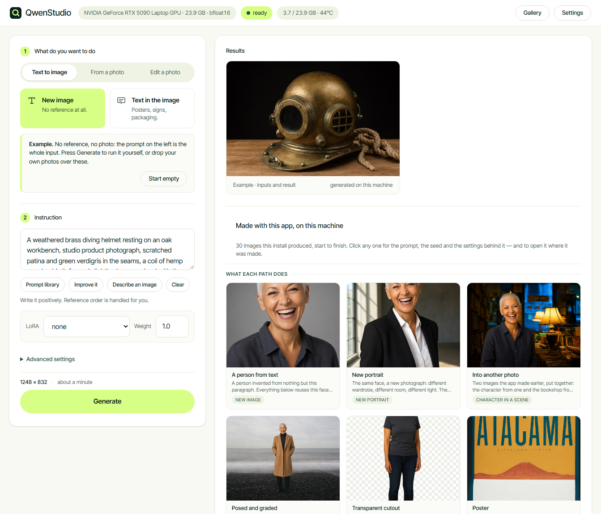
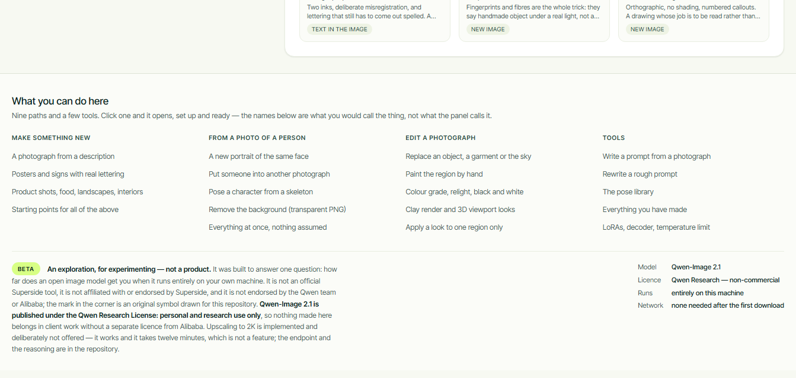
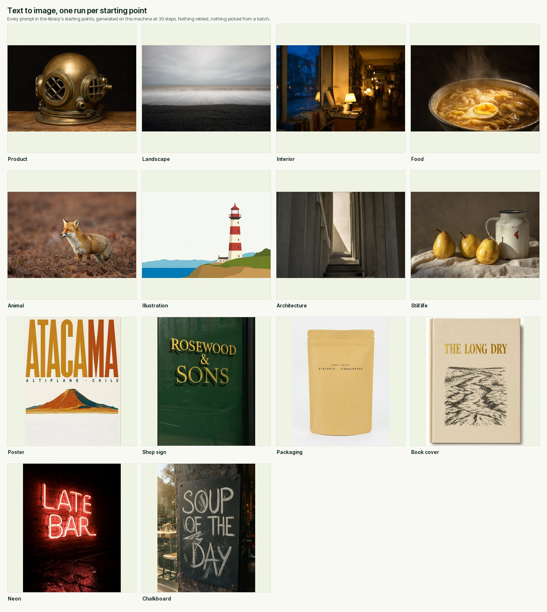
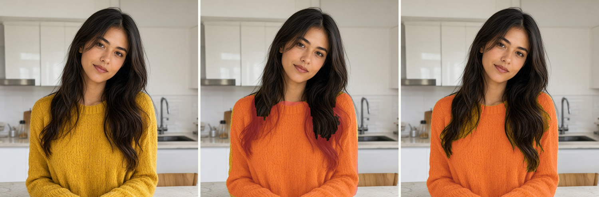
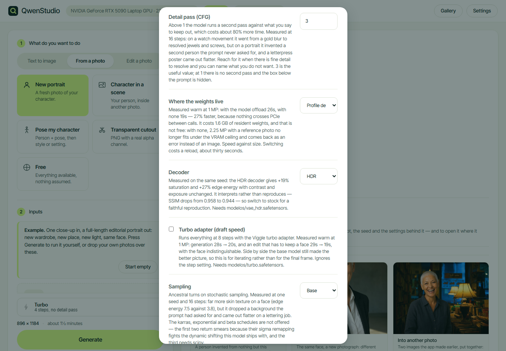

<p align="center">
  
</p>

<h1 align="center">QwenStudio</h1>

<p align="center">
  Local image generation and editing with Qwen-Image 2.1.<br>
  No ComfyUI, no cloud, no account, no API key.
</p>

---

> ### This is an exploration, not a product
>
> It was built to answer a question — *how far does an open image model get you
> when you run it entirely on your own machine?* — and the answer is written
> down here, measurements and failures included.
>
> **It is not an official Superside tool, it is not affiliated with or endorsed
> by Superside, and it is not endorsed by the Qwen team or Alibaba.** The
> interface borrows Superside's palette and typeface because the exploration
> happened there and it needed to look like something; the mark in the corner
> is an original symbol drawn for this repository, not the Superside logo.
>
> **Qwen-Image 2.1 is published under the Qwen Research License: personal and
> research use only.** Nothing produced with this belongs in client work
> without a separate licence from Alibaba. Inter Tight is bundled under the
> SIL Open Font License; CLIPSeg is MIT. See [Licences](#licences).

---

## Two ways to use it

**1. By hand.** Double-click, a page opens at `127.0.0.1:7860`, you drop
photos into boxes and press Generate. Nine use cases in three groups, each
showing only the inputs it needs, each opening with a worked example already
loaded.

**2. By agent.** Point Claude Code, Codex or any MCP client at this folder and
ask for what you want. The agent gets ten tools — generate, edit, describe,
batch, pose library, prompt library — and drives the same engine the interface
drives. The model loads once and both share it, so you can have the page open
while an agent works through a list of prompts in the background.

The second way is the one worth understanding: everything the interface can do
is an HTTP endpoint, and everything an agent needs is a thin layer over those
endpoints. The app is not a wrapper around a script — it is a local service
with two front doors.

---

## Install

```bash
git clone https://github.com/aaronamortegui-glitch/Qwen_studio.git QwenStudio
cd QwenStudio
```

Then double-click the installer for your platform:

| | install | run |
|---|---|---|
| **Windows** | `INSTALL.bat` | `RUN.bat` |
| **macOS** | `install.command` | `./run.command` |

The installer downloads **uv**, which brings its own Python 3.12 into this
folder. Nothing on your system is touched: no system Python, no global
packages, no PATH changes. Delete the folder and it is gone.

That includes the models. The image weights, Qwen3-VL, CLIPSeg and SAM 2 all
land in `modelos/`, downloaded on the first run and never again — not in
`~/.cache/huggingface`, where the two small ones used to go. After that first
download the app needs no network at all, which was the whole point and was
quietly untrue until it was checked.

It detects your hardware **before** installing anything and picks the profile
from it — which PyTorch wheel, which dtype, whether to quantise, how much to
offload, what resolution to cap at. The model weights (~31 GB) download on the
first run, with a resumable progress bar, so you can look at the detected
profile before committing the disk.

`SHORTCUT.bat` (Windows) puts a desktop shortcut with the icon on your desktop.

---

## What it looks like

<p align="center"></p>

Every use case opens with a **worked example**: the inputs it takes, already in
their boxes, and the contact sheet of a real run with exactly those inputs. The
first screen shows *this + this = this* instead of an empty form. Drop your own
photo over any box and the example steps aside.

<p align="center"></p>

And the results column is not empty on the first run. It opens with **thirty-one
images this install produced**, in two groups — what each path does, and how
far the style stretches — each one clickable for the prompt, the seed and
the settings behind it, and for a button that opens the use case it came from
with that prompt already in the box. Five of them build on each other: a
character is invented from a paragraph, that face is carried into a portrait, a
scene and a cutout, and two of the earlier images are then edited — so the
showcase is one tool doing a day's work, not eight unrelated demos. The second
group changes the visual language rather than the task — pixel art, isometric
tiles, game key art, a sitcom still, riso, ink, a patent drawing — because
range is an argument the use cases cannot make on their own. It steps
aside the moment you generate something of your own, and a link in the header
brings it back. Rebuild it as yours with `herramientas/vitrina.py`.

<p align="center"></p>

Nine paths and a handful of tools is more than fits on one screen, so the footer
carries **an index of the whole thing** — and each entry is named the way you
would ask for it, not the way the panel is labelled. Someone looking to *remove
the background* will not guess that it lives under **Transparent cutout**, so
that is what the index calls it; clicking takes you there with the case already
set up. Next to it, in one place, the two sentences anyone needs before they
send an image anywhere: this is a beta built to experiment with, and the model's
licence is non-commercial.

<p align="center"></p>

Words in quotes come out as **actual lettering**. This is the thing Qwen-Image
does better than almost anything else you can run locally, and the poster above
was generated on the machine described below, at 35 steps, first try.

<p align="center"></p>

Every starting point the prompt library offers for the two text-to-image paths,
run once each at 30 steps. Nothing retried, nothing picked from a batch —
fourteen prompts, fourteen images, in the order they came out. Six of them ask
for lettering (`ATACAMA`, `ROSEWOOD & SONS`, `SINGLE ORIGIN · ETHIOPIA ·
YIRGACHEFFE`, `THE LONG DRY`, `LATE BAR`, `SOUP OF THE DAY`) and all six are
spelled correctly. Regenerate the sheet with
`herramientas\hoja_muestra.py`.

<p align="center"></p>

An edit can also take **a photo of what goes there**, in the optional Reference
box: paint or name the region, write what it is in a few words, and drop in a
picture of the material. The reference is subordinate to the text on purpose —
an earlier version told the model the reference "must appear in the region" and
it pasted the whole reference photo, landscape and all, into the mask. It now
says the text describes *what* is built and the reference shows *how it looks*,
and only the colour, material and pattern come across.

An edit selects its region from **words** or from a **brush**. Painting happens
at the photo's real resolution; what you leave untouched comes back byte for
byte, which the test suite checks rather than assumes.

**Both editing paths take the brush**, because both are the same operation
underneath: crop around the region, regenerate the crop, feather it back in.
Replacing something needs a region and lets you name it in words instead of
painting it. A look does not need one — leave it alone and the treatment covers
the whole photograph, which is what a grade is for — but painting one confines
the look to that region, so you can relight a face or turn just the subject to
clay and have the rest of the frame come back untouched.

<p align="center"></p>

When you select by words, **two models do it.** CLIPSeg takes the text and finds
roughly where the thing is; SAM 2 takes CLIPSeg's box and centre and returns the
object that is actually there. Above: the original, CLIPSeg alone, and the pair.
CLIPSeg works at 352×352 and its output, scaled back up, takes in the hair
falling across the garment — the orange blotches in the middle frame. Asking for
`the yellow sweater` went from 28.3% of the frame to 22.2%, and the 6 points it
gave back are the hair.

SAM 2 does not accept text and CLIPSeg does, so each does the half it is good
at. The refiner is `sam2.1-hiera-tiny`: 31M parameters, about 150 MB, eight
seconds to load and under a second to run. If it is missing or fails, the
CLIPSeg mask is used unchanged — a worse mask beats an exception. Turn it off in
Settings. (SAM **3**, which the ComfyUI workflows use and which does take text,
is not in transformers 5.17.)

<p align="center"></p>

Thirty poses. The thumbnail is the photo, because that is what you recognise;
hover and it swaps to the OpenPose skeleton, because that is what the model
actually receives.

<p align="center"></p>

Looks are picked from a grid, not typed. Every thumbnail is that effect applied
to this install's own reference photo, generated here — so the grid shows this
model doing this thing, not a screenshot of someone else's pipeline.

<p align="center"></p>

Match a style asks for two pictures and keeps them straight: the photograph
supplies everything you can see, and the reference supplies only how it is
made. The slot says so, because the first thing anyone tries is dropping in a
picture of a person and expecting the clothes.

<p align="center"></p>

The four settings that change how every image is made sit together, and each
one carries the measurement that decided its default rather than an adjective.
None of them is on by default, because none of them measured as a free win.

<p align="center"></p>

**Everything you make lands in `salidas/`** and the Gallery reads that folder
directly — there is no database to fall out of sync with the disk. Delete a
file there and it is gone from here. Every tile and every result carries a
download button, and **Open the folder** hands you to the file manager.

Every gallery tile and every result carries a bin that moves the file to
`salidas/_papelera/` rather than unlinking it — in the gallery as a × on the
thumbnail, in the results column as an icon beside Download, so a run that
produced six variants can be cut down to the one worth keeping without
opening anything. A grid of thumbnails that look alike is exactly where a
click you cannot undo loses the good one; the bin stays on disk and emptying
it is your call, not the app's.

<p align="center"></p>

Light by default, dark in Settings, or Auto to follow the system.

---

## What it does

| Group | Use case | Inputs |
|---|---|---|
| **Text to image** | New image | nothing but the prompt |
| | Text in the image | words in quotes come out as lettering |
| **From a photo** | New portrait | person photos |
| | Character in a scene | person + a photo of the setting |
| | Pose my character | person + pose + optional style and setting |
| | Transparent cutout | person → PNG with a real alpha channel |
| | Free | everything, nothing assumed |
| **Edit a photo** | Apply a look | image + a treatment picked from a grid, optionally a painted region |
| | Match a style | image + a picture whose manner you want |
| | Replace something | image + a selection + what goes there |

Plus a **pose library** (30 skeletons across close-up, half and full body), a
**prompt library** (one clause of a photograph each: a second pick from the
same category swaps the first out rather than stacking both, so asking for
golden hour after studio light means golden hour, and anything typed by hand
is left alone), **image description and reasoning** with Qwen3-VL, **LoRA** loading,
the seven official aspect ratios, 2K native output, a **before/after slider**
on every edit, and a **contact sheet** per run showing inputs + result.

Three engine settings sit in the panel, each off or neutral by default because
each was measured to be a trade rather than a free win:

| Setting | What it does | Measured |
|---|---|---|
| **Detail pass (CFG)** | a second forward pass against what you say to keep out | +80% time. Turned a blurred watch movement into resolved jewels and screws. On a portrait at 16 steps it invented a second person the prompt never asked for. **Without a negative prompt it does nothing at all** — identical output, identical time |
| **Turbo adapter** | everything at 8 steps with the Viggle adapter | generation 28 s → 20 s, an edit that must keep a face 29 s → 19 s, face indistinguishable. At the 4 steps it advertises it returns ghost hands. Side by side the base model still made the better picture |
| **Sampling** | `base`, or `ancestral` (stochastic) | ancestral: far more skin texture on a face, but it dropped a background the prompt asked for and came out flatter on lettering. The karras, exponential and beta schedules are not offered — the first two return smears, because their sigma remapping fights the dynamic shifting this model ships with, and the third needs scipy |

On a machine that cannot run this usefully, the installer and the app both say
so plainly — with a puppy — and then let you through anyway.

---

## How this differs from a closed model

Not "better". Different in ways that decide whether it fits what you are doing.

| | QwenStudio, locally | A hosted closed model |
|---|---|---|
| **Where the image goes** | nowhere. No upload, no retention, no terms about your inputs | to a server, under whatever the terms say today |
| **Cost per image** | electricity | per call, forever |
| **Works offline** | yes, once the weights are down | no |
| **The prompt you sent** | exactly what you wrote, plus scaffolding you can read in `motor.py` | rewritten by a layer you cannot see |
| **Refusals** | none of its own | a moderation policy that changes without notice |
| **Reproducibility** | same seed, same weights, same image, in a year | the model is swapped underneath you |
| **Identity from a photo** | reference images, no training run | usually not offered at all |
| **Speed** | 62 s at 1 MP, 239 s at 2K, on a 24 GB laptop GPU | seconds |
| **Peak quality** | very good | usually better |
| **Licence to sell the output** | **no** — Qwen Research License | usually yes |

The honest summary: a closed model is faster, often prettier, and legally
simpler to sell. This is private, free to run, reproducible, inspectable, and
yours — and the prompt scaffolding that makes identity transfer work is written
in a file you can open and argue with.

That last point is the interesting one. Every rule the app applies was measured
rather than assumed, and the ones that surprised us are in **Things worth
knowing** below. A closed model gives you a result; this gives you a result and
the reason.

---

## The four reference slots

Each does exactly one job, so they compose without fighting:

| slot | gives | stays out of it |
|---|---|---|
| **Person** | the face and identity | everything else |
| **Pose** | posture, limbs, head tilt | build and height — those stay the person's |
| **Style** | grade, contrast, grain, quality of light | its subject, setting and composition |
| **Scene** | place, wardrobe, framing, lighting | the face |

The prompt is assembled from whichever slots you filled: no pose, no skeleton
clause. Every reference is tagged `<image1>`, `<image2>`… and the tag is
repeated inside its own instruction, because the text encoder reserves one
vision slot per tag and that binding is what keeps them apart.

The order is not yours to choose, and that is deliberate — see below.

The **Style** slot serves two different jobs, and the interface says which one
you are in. In the generation paths it lends a grade — contrast, grain, the
quality of the light. In **Match a style** it lends a whole visual language,
and it is not handed to the generator as a picture at all. See below.

---

## Match a style

Take a photograph and remake it the way another picture is made: same subject,
same pose, same framing, a different medium.

The naive version of this does not work, and finding out why is the useful
part. Handing the model the painting as `<image2>` and asking for *the style of
`<image2>`* barely moves the image. Worse, what does come across is the
painting's **subject**: a lighthouse from an illustration landed in the middle
of a portrait, and a botanical watercolour replaced the sitter entirely with
its own rosemary and fig. One case in three survived.

What works is words. Measured against three phrasings, the only one that moved
the picture named the technique — *flat vector shapes, a small number of flat
colours, no gradients, no photographic texture, crisp geometric edges*. So the
app reads the reference with Qwen3-VL first, asking only **how** the picture is
made and never what it shows, and sends that description to the generator with
a single image. Three of three keep the sitter that way.

The reference picture is still passed when the vision model could not read it,
which is better than nothing. The description it produced is written into the
result's recipe as `tecnica_leida`, so when a restyle goes wrong you can see
whether it failed at reading or at painting — two different repairs.

---

## Tell it what to change

Every other edit in this app selects a region, regenerates it and stitches it
back. That is right when the change is bounded — a sweater, a sky — and wrong
when it is not: swapping the person in a photograph is not a patch, and a patch
is what it looks like. This path hands the model the whole picture, up to three
references and a sentence, and lets it decide where to touch.

The sentence decides whether anything happens at all, and the rule is not
obvious. Measured on 2026-09-23 with the same picture, the same reference and
the same seed:

| instruction | result |
|---|---|
| *Replace the woman with the man from `<image2>`.* | nothing changed |
| *Replace the woman's face and hair with those from `<image2>`.* | nothing changed |
| *Replace the face, the hair and the beard with those from `<image2>`, and change the clothing to a dark t-shirt.* | **the swap happened** |

**Name the attribute, not the person.** It is the rule in QwenLM's own
`prompt_rewrite/prompts/system_prompt_edit.txt`, and the failure it prevents is
the one they call *under-editing*: an output so close to the input that it
looks like nothing ran.

**And the verb matters more than the documentation suggests.** Same picture,
same reference, same seed, the same attributes named, only the verb changed:

| construction | what it did |
|---|---|
| *put X from `<image2>` on …* | the strongest exchange |
| *swap X for …* | close behind |
| *replace X with …* | grafted the new feature onto the old face |
| *change X to …* | the same |
| *give … the X from …* | almost nothing |
| *edit X to match …* | nothing |

`replace` is the verb every example uses, this README's included, and it sits in
the middle.

**And to change who someone is, name the clothing.** Same picture, same
reference, same seed, only the list of attributes growing:

| named | result |
|---|---|
| face, hair, beard | a beard grafted onto the original face |
| + body and build | no further change at all |
| **+ clothing** | **the whole exchange** |
| *the person* | nothing, as always |

Body and build did nothing; the garment did everything. While the original
jacket stays, the jacket holds the original person in place — the model is
painting what can be seen, not reasoning about who someone is. This one would
not have been guessed. A difference metric could not rank these — all six scored between
11.7 and 13.3 against the source, because global difference is dominated by
light rather than by a face. The eye separates them easily, which is worth
remembering before trusting a number that happens to be easy to compute.

Two more of their rules are built into the clause this app wraps around your
sentence, because both were learned here the expensive way:

- **The operation comes first, the preservation after.** This was the other way
  round at first, and the result was an output that ignored the instruction.
- **Preservation stays generic.** The clause says "everything else is
  unchanged" and does not list what that is. Naming the place, the light and
  the framing made the model reproduce a place, a light and a framing — the
  reference's, not the target's. Their phrasing for this is worth keeping:
  say what stays, without repainting it.

Three things were tried and did not help, which is worth writing down so they
are not tried again: the size of the reference image (0.26, 0.92 and 2.0 MP
gave identical output), naming who stays rather than who arrives, and adding an
identity tail after the instruction — that last one made it worse, because with
`<image2>` in the final sentence the model returns `<image2>` whole.

**The rewriter looks at the reference before it writes about it.** Left to the
text alone it guessed: asked to swap a person, it wrote "change the clothing to
the jacket and pants from `<image2>`" about a photograph of a man in a t-shirt.
It now reads the reference with Qwen3-VL first — one sentence, only what can be
seen — and names the garment that is actually there. Same request, same
reference, with and without that look:

| | the instruction it produced |
|---|---|
| text only | …change the clothing to **the jacket and pants** from `<image2>`. |
| having looked | …change the clothing to **a maroon short-sleeved t-shirt**. |

One example in a rule is a template, and two examples are a rule. With a single
worked example the rewriter copied its exact wording and asked for a beard on a
reference that had none; with two examples differing only in what the reference
showed, it started adapting the list — "the face, the hair and the beard" for
one, "the face and the hair" for the other.

Person swapping remains the hard case and is not reliable in both directions;
the model's own card lists face swaps among its known weak points. Ordinary
edits — a garment, an object, a background — work with an ordinary sentence.

---

## Things worth knowing

Everything here was measured in one long session on the hardware listed further
down. Where a belief turned out to be wrong, the wrong version is left in.

**Reference order decides everything.** Identity transfers when the person is
`<image1>`; with the scene first the scene dominates and the face does not
change at all. It fails *silently*, producing a plausible image that is simply
the wrong person. The app always orders person → pose → style → scene, and
`refs` and the `<imageN>` numbering are built in the same function so they
cannot drift apart. Every response carries an `orden` field naming which slot
got which tag.

**A scene with a person in it will hand you that person.** The identity clause
sits at the start of the prompt and the scene reference, closer to the end,
outranks it: with a female scene and a male reference, the result came back as
the woman from the scene — right size, right light, wrong human. The fix is
recency: the prompt now repeats, *after* the scene clause, that the one person
in the result is the subject from `<image1>`. Same seed, same inputs, correct
face.

**With a scene, use one photo of the person.** Several photos of the same
person are read as several *different* people, and you get several people in
the frame.

**The transparency wording is the model author's, not ours.** The app used to
append its own clause about a cut-out on a transparent background, which
worked. Measured against the wrapper the model card publishes — same seed, same
subject — the official one came out at 68.4% real alpha against 65.7%. A small
margin, but there is no reason to invent wording when the people who trained it
published some, so the prompt is now wrapped rather than suffixed.

**Prompts go positive but imperative.** There is no negative guidance at
cfg 1, so "ignore the background" just injects the concept. But softening the
verb breaks it too: "the face is hers" does not transfer, "the subject's face
must match `<image1>` exactly" does. The scaffolding says "the subject" rather
than he or she — a pronoun that disagrees with the reference photo is one more
thing for the model to resolve, and it does not always resolve it your way.

**A reference is ignored unless the prompt names what to take from it.** With a
scene loaded and a neutral prompt, the scene contributed *nothing* — the
scaffolding clause alone was not enough. The app now describes the scene with
Qwen3-VL and appends that description, which is what makes the path work.

**Crop-and-stitch is for a local change, not for a garment.** Replacing a
sweater with a jacket keeps failing, and sharpening the mask made it plainer
why. The crop taken around the mask still shows the sleeves as context, the
model harmonises with what it can see, and out comes a jacket painted over a
sweater whose arms stayed yellow. Recolouring the same sweater in the same
crop works — 86% of the yellow gone, measured on pixels rather than read off a
description. The rule is the shape of the edit, not its difficulty: a change
that stays inside the crop lands, a change to something that leaves the crop
fights the context. For a whole garment, use the whole-frame path.

**"Replace X" is read as "add X on top of X".** Asking for a denim jacket over
the mask of a yellow sweater returned the jacket *open*, with the sweater
underneath. The mask had room for both and the model used it. Saying the
garment is closed and that nothing is visible underneath is what turns a layer
into a replacement.

**int8 quantisation was counterproductive.** The hypothesis was that it would
save memory. Measured: 2.8 s/step and 24.1 GB peak, against 1.26 s/step and
21.2 GB unquantised — bitsandbytes int8 casts bf16↔fp16 on every matmul. It is
not in the profile ladder at all; nf4 only appears below 16 GB, where the
transformer genuinely does not fit.

**Describing an image costs no extra download.** The image model's text encoder
*is* Qwen3-VL-8B, and the checkpoint on disk carries the vision tower and the
language head. The same 16 GB serve both jobs; it loads in 4-bit so it can sit
beside the DiT.

**You cannot burn the card with this, and the app says so.** The thermal limit
is enforced by the firmware, below the driver: around 83–88 °C it clocks itself
down and near 95 °C it cuts out, and nothing in user space overrides that. What
does happen is a laptop sitting at 85 °C for two hours on a fifty-image batch,
throttling the whole way and taking twice as long while nobody understands why.
So the meter shows the temperature, says when the card is throttling, and a
setting makes a batch wait between images until it drops below a threshold —
80 °C by default, 0 to turn it off. That is not damage protection. It is the
difference between a long run finishing and a long run crawling.

**Close anything else using the GPU first.** Starting with VRAM half full makes
generation crawl with no error at all: utilisation reads 100%, power draw stays
low, nothing finishes. Half an hour was lost to a forgotten ComfyUI process
before the app learned to warn about it — and then a second time, mid-build,
which is why the header now carries a **VRAM meter** reading `18.2 / 23.9 GB`
and naming how much of that belongs to something else. Click it and the app
unmounts its models and hands the memory back, no restart. When the number is
someone else's, the meter says so, because then the fix is not here.

---

## Measured here (RTX 5090 Laptop, 24 GB)

Every row is a single warm run through the app's own API, at the defaults the
app ships with today: **nf4 on both the transformer and the text encoder, 16
steps, VAE tiling on**. Peak VRAM is `nvidia-smi` sampled every 0.2 s, because
the number that decides whether a card can do this at all is the peak and not
the average.

| What | Output | Time | Peak VRAM |
|---|---|---|---|
| generate, 1 MP | 1024 × 1024 | **26 s** | 7.3 GB |
| generate, 2 MP | 1440 × 1440 | **51 s** | 7.3 GB |
| generate, 4 MP · 2K native | 2048 × 2048 | **122 s** | 7.5 GB |
| a look or an edit, 1 MP | 832 × 1088 | **26 s** | 9.2 GB |
| rescale to 2K | 1792 × 2048 | **156 s** | 18.2 GB |

The rows above are without the detail pass. It is on by default and it runs a
second forward pass, so everything below costs roughly 1.8× what the same job
costs without it. These are the numbers the app actually produces today,
measured across every use case in one pass with one photograph:

| With the detail pass on | Output | Time | Peak VRAM |
|---|---|---|---|
| portrait from one reference | 1344 × 1760 | 166 s | 18.5 GB |
| into a scene, two references | 1248 × 832 | 106 s | 17.1 GB |
| a pose, two references | 896 × 1184 | 73 s | 16.9 GB |
| **a pose and a style, three references** | 896 × 1184 | 87 s | **21.0 GB** |
| a look on a photograph | 512 × 512 | 14 s | 8.2 GB |
| replace a garment, by mask | 512 × 512 | 89 s | 13.1 GB |
| the same by instruction, no mask | 512 × 512 | 14 s | 8.4 GB |
| rescale | 1536 × 1536 | 87 s | 13.5 GB |

**Three references is the expensive corner**, and the only row that comes near
the ceiling. Note also that a look or an instruction edit costs what the source
photograph costs, not what the setting asks for: both rows above are 512 px
because the photograph was, and both took 14 seconds.

**Three ceilings, and a hard floor under all of them.** Generating at 2K costs
7.5 GB; one reference at 2K costs 18.2 to 19.2; two references at 2K took this
machine down. So the profile carries a size without a reference, a size with
one, and a size with several — and, underneath, a limit on what the process may
allocate at all.

That last one is the important one. On 2026-09-23 this machine blue-screened
twice, same bugcheck and the same four parameters, both times while a test
pushed a 24 GB card against its wall. There was a guard: a thread watching
`nvidia-smi` that cancelled the run past a threshold. It never fired in time,
because cancellation lands between denoising steps and the allocation spike
happens inside one.

The allocator can do what the watcher could not.
`torch.cuda.set_per_process_memory_fraction` makes PyTorch raise
`OutOfMemoryError` at the moment of the allocation, which is an exception the
app catches and turns into a sentence. The reserve is proportional — 15% of the
card, capped at 4 GB, floored at 1.5 — so a 24 GB card stops at 20.3 and an 8 GB
card at 6.5. Verified at 4 GB and again at 12 with a job that wanted 19: it
stopped at 11.0 GB and said *"that was too large for this card"*.

Between images the cache goes back to the driver, so the card sits at 1.0 GB
used with the model still mounted, and the machine stays usable while the app
is open.

On Apple Silicon this field is zero: `set_per_process_memory_fraction` has no
MPS equivalent, and there is no honest way to pretend otherwise.

**nf4 is not the poor mode, it is the good one.** Against bf16 on this card it
is faster (56 s against 73 s at the old 25-step default), uses half the memory,
and is the only way 2K works at all — under bf16 a 4 MP job with a reference
paged for hours. At the same seed the two are indistinguishable by eye. bf16
only wins where the whole 29.6 GB of weights fits resident, which means 40 GB
and up.

> **A recipe made in bf16 does not reproduce in nf4 at the same seed.**
> Changing the precision changes every step slightly, and sixteen steps amplify
> that into a different picture. The seed in a recipe is only a promise within
> one precision. The app records the quantisation in the recipe for this
> reason.

**Time grows with the square of the megapixels, not with the megapixels.**
Attention cost rises with the square of the token count. Doubling the pixels
does not double the wait; going from 1 MP to 4 MP is nearly five times it.

**Steps are cheap on the clock and not cheap in the picture.** That distinction
cost a regeneration to learn. At 1 MP the clock barely moves — 8 steps 18 s, 12
steps 21 s, 16 steps 27 s, 20 steps 33 s, 25 steps 38 s — but the picture moves
a great deal up to 16 and almost none after. Swept on a subject built to break
first, a watch movement and a hand: 8 steps is mush, 12 leaves the movement
soft, 16 resolves its screws and jewels, and 20 and 25 add nothing worth the
extra 5 and 11 seconds. **16 is the knee.** 12 is a draft.

| | |
|---|---|
| model load (first call) | 27–35 s |
| segmentation, 3 phrases | 0.9 s |
| describe an image (Qwen3-VL 4-bit) | 5–9 s, 7.1 GB |
| read the technique of a style reference | 5–9 s, once per restyle |

The app does not make you read this table. It shows the output size and an
estimate above the Generate button, and corrects that estimate from your own
runs, so after one generation it is describing your card rather than mine.

### How long a generation takes, by card

Only the first row is measured, and only on Windows — there is no Apple Silicon
here to time. The rest follow from the profile the hardware detection picks,
scaled by the shape above. They are extrapolations from one card, not
benchmarks, and they are labelled that way on purpose.

| Your GPU | Profile | 1 MP | 4 MP · 2K | Ceiling with a reference |
|---|---|---|---|---|
| RTX 5090 / 4090 laptop, 24 GB | L | **26 s** *(measured)* | **122 s** *(measured)* | 2048 *(measured)* |
| 40 GB and up | XL | ~18 s | ~80 s | 2048 |
| 20–24 GB | L | ~26 s | ~2 min | 2048 |
| 12–20 GB | M | ~40 s | ~3 min | 1024 |
| 8–12 GB | S | ~3–6 min | not advisable | 1024 |
| under 8 GB | MINIMO | ~10 min+ | no | 1024 |
| Apple Silicon, 32 GB+ | M | unmeasured | unmeasured | — |
| no compatible GPU | INVIABLE | over half an hour | no | — |

The line that matters is 12 GB. Above it the nf4 transformer stays resident and
the card is doing arithmetic; below it, sequential offload moves layers across
PCIe on every step of every image and the card is mostly waiting on the bus.

**Why a hosted turbo demo is faster, counted rather than guessed.** The Viggle
Space runs the same adapter this app carries, and it is not one thing:

| | there | here | ours to take? |
|---|---|---|---|
| steps | 4 | 16 | only by giving up detail |
| CFG | off | on, ×2 | the same trade |
| offload | none | model | 27%, measured |
| references | capped at 1 MP | were uncapped | **taken** |
| GPU | large, resident | 24 GB laptop | no |

Sixteen steps with the detail pass is thirty-two transformer passes against
their four, before hardware enters into it. Two of those five rows are choices
about quality, one is not available, and two were worth taking.

The reference cap is taken and free: their code encodes every conditioning
image at 1024-area, "as in distillation", and this app was passing whatever
arrived. A 12 MP phone photo went into the attention sequence at twelve times
the area the model was trained to see, and the cost was paid in memory rather
than in quality. Capped, that same photo now peaks at 11.1 GB, the same as a
1 MP one.

The offload is a trade rather than a win: warm at 1 MP it is 26 s with the
model offload and 19 s without, but the 1.6 GB of resident weights mean 2.25 MP
with a reference no longer fits under the ceiling. It ships as a setting with
both numbers on it, defaulting to the one that keeps the sizes.

> **Sequential offload does not work with nf4 weights.** Reproduced at 0.5 MP
> and 8 steps: `NotImplementedError: Cannot copy out of meta tensor`. accelerate
> cannot move layer by layer what bitsandbytes has already quantised. The
> profiles for cards under 12 GB had it, which means this app could not produce
> a single image on them — and nobody saw it, because the only card here has 24
> GB. They now use the model offload, and a stale `config.json` is corrected at
> load with a line in the log rather than that message about meta tensors.
> Whether the model offload is enough on an 8 GB card is untested: there is no
> such card here to test it with.

**ComfyUI is still faster for the same image**, and it is worth being precise
about why, because the obvious answer turned out to be wrong. The PR that added
Qwen-Image 2.1 to ComfyUI,
[Comfy-Org/ComfyUI#16400](https://github.com/Comfy-Org/ComfyUI/pull/16400),
highlights prefix caching of text and reference tokens — worth roughly 1.7× on
edits — and this README used to say that was something diffusers does not do.
It does: `QwenImage21Pipeline.__call__` takes `use_kv_cache`, it defaults to
`True`, and we have been getting it all along. The gap is elsewhere: ComfyUI
runs `int8_convrot` weights with kernels built for them, and its memory manager
is better than what `enable_model_cpu_offload` gives us. If raw speed matters
more than being self-contained, use ComfyUI.

---

## Control it from an agent

[AGENTS.md](AGENTS.md) is the operating manual for an agent working on this
repository: the ceilings it must not exceed, the prompting rules that were
measured, and what is deliberately not reliable. `CLAUDE.md` points at the
same file, so Claude Code and Codex read one thing.

```json
{"mcpServers": {"qwenstudio": {
  "command": "D:\\QwenStudio\\.venv\\Scripts\\python.exe",
  "args": ["-m", "qwenstudio.mcp_server"],
  "cwd": "D:\\QwenStudio"}}}
```

On macOS the command is `.venv/bin/python` and `cwd` is wherever you cloned it.

Twelve tools: `status`, `list_poses`, `list_loras`, `list_looks`,
`prompt_library`, `describe_image`, `generate`, `generate_batch`,
`preview_selection`, `inpaint`, `apply_look`, `unmount`.

`inpaint`, `apply_look` and `preview_selection` take either `select` (words) or `mask` (the
path to a black and white image, white where the edit goes), so a script that
already knows the region does not have to describe it back into words.

Images go in and out as **file paths, not base64**. Start the app first: the
MCP server is a thin layer over it, so the model loads once and the UI and the
agent share it. `generate_batch` runs a list of prompts with the model mounted
throughout — made for the case where something else writes the prompts.

Deep links work too: `?caso=pose` opens the app on that path, `?abrir=poses`
(or `prompts`, `ajustes`, `galeria`, `mask`) opens it with that panel showing,
and `?tema=dark` picks the theme. Useful for sending someone the exact screen,
and for an agent that wants to say "open it here" instead of describing three
clicks.

---

## Every image carries its own recipe

<p align="center"></p>

Click any result, in the gallery or in the run you just made, and it opens what
produced it: the exact prompt, the seed, the steps, the decoder, the LoRA, the
reference order. Then **copy the prompt**, **put it back in the box**, or
**use the image as input** for the case you are in, which is how you chain a
generation into a look without going through the disk.

The recipe is written into the PNG itself as tEXt chunks, the way ComfyUI and
A1111 do it — not into a sidecar and not into a database. It survives the file
being moved, copied or sent to someone, and there is no second store to fall
out of sync with the folder. A file made before this existed simply says so.

**The prompt library knows where you are.** Each use case sees the categories
that apply to it and, above them, starting points written for that path — a
text-to-image case opens on eight complete prompts, an edit opens on garments
and backgrounds. Offering winter coats to someone who is upscaling a photo
only makes them doubt what the field is for.

**Improve it** rewrites a few loose words into a full prompt, using the
Qwen3-VL that is already resident. Text only, no network, about 19 s, and the
system prompt is built from the rules measured in this project rather than a
generic "make it better":

> *a guy on a bike in the rain, night, cool*

becomes

> *A guy on a bike, wearing a dark waterproof jacket with a hood pulled up,
> gloves, and rain-slicked jeans, leaning forward over the handlebars with a
> wet helmet resting on his lap, the bike's chrome fender gleaming under
> streetlight, standing on a wet cobblestone street at night, framed in a
> medium shot from slightly low angle, caught in a vertical rain curtain with
> streaks of light reflecting off puddles, lit by the warm glow of a single
> sodium streetlamp casting long shadows, captured with a shallow depth of
> field using a 35mm lens.*

Subject, then clothing, then place, then framing, then light, then lens — the
order the model actually weights. The workflow that does this elsewhere sends
your prompt to a translation API and then to a hosted LLM; this one never
leaves the machine.

---

## The HDR VAE

The VAE is the last step: it turns the latent the model produced into pixels.
Swapping it changes nothing about *what* was generated and everything about how
it is rendered.

<p align="center"></p>

Same seed, same prompt, same latent — only the decoder differs. Stock on the
left, HDR on the right. Measured on the pair above:

| | stock | HDR | change |
|---|---|---|---|
| saturation | 0.2391 | 0.2851 | **+19.2%** |
| gradient energy | 0.0136 | 0.0172 | **+27.1%** |
| contrast | 0.2279 | 0.2292 | +0.5% |
| mean luminance | 0.2409 | 0.2417 | +0.3% |

The last two rows are the interesting ones: it is not simply pushing every
slider. Contrast and exposure sit still while colour and edge detail come up —
you can see it in the rim light on the hair and in the texture of the beard.

It is **on by default** when the file is present, and there is a switch in
Settings. The trade is real and its author states it: SSIM drops from 0.958 to
0.944 and PSNR loses 6 dB. This VAE does not reconstruct the latent more
faithfully, it interprets it with more contrast, more edge and more saturation.
For a portrait that reads as better. For a faithful reproduction of a source
image it is the wrong tool, and that is what the switch is for.

Switching decoder costs a reload, about thirty seconds. That is deliberate:
loading the weights into a mounted pipeline leaves tensors stranded on CPU,
because with model offload the weights belong to accelerate and
`load_state_dict` writes underneath its hooks. The first version did it in
place and the next edit died with *"Expected all tensors to be on the same
device"*. The swap now happens before any hook is installed, which means before
the pipeline finishes loading.

The file is **not part of the 31 GB download**. Put
`qwen21HDRVAE_diffusersFormat_fp16.safetensors` into `modelos/` as
`vae_hdr.safetensors` and the option appears; without it the app uses the stock
VAE and says nothing. It comes from
[Qwen 2.1 HDR VAE](https://civitai.com/models/2955671/qwen-21-hdr-vae), which
publishes it in diffusers format specifically because it is built for the
`QwenImage21Pipeline` path — its own notes say ComfyUI support is uncertain.
It is one of the few places where going through diffusers is the advantage
rather than the cost.

---

## Looks and upscaling

**Apply a look** takes one image and a treatment picked from a grid, and
optionally a region painted with the same brush the replacement path uses. With
no region the look grades the whole frame; with one it goes through the same
crop-and-stitch as a replacement, so everything outside the paint returns
unchanged. The
thumbnails are that effect applied to this install's own reference photo,
generated here, so the grid shows this model doing this thing rather than
someone else's pipeline. Effects needing a LoRA stay visible when the file is
missing and say which one they need, rather than disappearing.

Sixteen looks in five groups: grades, relighting, the three Blender viewport
modes from the
[Look Development Pack](https://civitai.com/models/2953686/look-development-pack-for-qwen-image-21)
(a genuine Qwen-Image 2.1 LoRA), and two groups added from what
[TostUI](https://github.com/camenduru/TostUI) exposes — **Redraw** (Anime,
Photographic, Chibi) and **Repair** (Deblur, More detail). Those six are
prompts rather than weights, so they cost nothing but the writing. Two things
they taught, both worth the regeneration they cost:

- The preservation clause the grading looks use — *the face stays exactly as it
  is* — contradicts a look whose whole job is to redraw, and the model answers
  a contradiction by doing nothing. The redrawing looks name what is actually
  kept instead.
- Three of them showed nothing at all against the shared reference photo,
  because that photo is already a sharp photograph. A thumbnail that undersells
  the effect is worse than no thumbnail, so Photographic now starts from a
  drawing and Deblur and More detail from that same photo broken on purpose.

**Rescaling to 2K is back in the interface.** The technique always worked — the
image goes back in as its own reference and the model redraws it larger, which
recovers real detail instead of interpolating pixels — but under bf16 it took
**754 seconds** for 775×1024 → 1792×2048, and twelve minutes for one upscale is
not a feature. With nf4 and VAE tiling the same job is **156 seconds** at a
18.2 GB peak. The button came back when the number did.

---

## LoRAs

Drop `.safetensors` files into `loras/` and reload. The selector appears under
the prompt only when there is something in the folder, with a weight beside it.

**Check which model a LoRA was trained for.** The relight LoRAs circulating on
Civitai — [dx8152's Qwen-Image-Edit 2509 Relight](https://civitai.com/models/2076009/qwen-image-edit2509-relight),
[Relight_Qwen edit 2511](https://civitai.com/models/2293278/relightqwen-edit-2511) —
are built for **Qwen-Image-Edit 2509/2511**, a different generation with a
different architecture. They are not interchangeable with Qwen-Image 2.1 and
are not shipped as use cases here, because none of them has been verified
against this model. Loading one aimed at another architecture is treated as a
user error rather than a crash: the app says so and carries on unmodified.

If you find or train a LoRA that genuinely targets Qwen-Image 2.1, it drops
straight in. Reference-based identity already works without one, which is why
there is no training step in this project at all.

---

## Mounting and unmounting

Three models want the same GPU: the 7B image transformer, Qwen3-VL for
description, and CLIPSeg for segmentation. The registry in `recursos.py` knows
which can coexist:

```
imagen   ->  unmounts vision and segmenta   (generating peaks near 21 GB)
vision   ->  unmounts segmenta              (7 GB sits beside the idle DiT)
segmenta ->  unmounts vision
```

The image pipeline is never unmounted: with model offload its weights live in
CPU memory and cost about 0.4 GB idle, so evicting it would only buy a reload.
For batch work there is a setting that keeps everything mounted and skips the
swapping entirely.

---

## Testing

```bash
.venv\Scripts\python.exe herramientas\pruebas\todos_los_caminos.py
```

Twenty-one cases, run against the live app. They check the **shape** of what came
back, not just the absence of an exception — a 1024 square returned when 16:9
was asked for is broken even though nothing raised.

Where the instruction can be read off the image, **Qwen3-VL looks at the
result** and the case fails if the model did not do what was asked. That is
what caught the layered-jacket bug above: the image was the right size, the
mask was right, and the edit was wrong.

```bash
.venv\Scripts\python.exe herramientas\revision_ui.py
```

A static pass over the interface, which is one Python string holding HTML, CSS
and JS and therefore type-checked by nobody. It catches the failures that do
not raise: a colour token left behind by a rename (the element just renders
transparent), a `$('#id')` whose element was deleted (the handler silently
never binds), a dialog with no way out, a duplicate id, Spanish text that
escaped into the English interface. Two of those had already shipped in this
file before the script existed, which is why it exists.

```bash
.venv\Scripts\python.exe herramientas\revision_idioma.py
```

The same idea applied to the language rule. Everything committed here is
English, and this reads every tracked Python file looking for Spanish in a
comment, a docstring or a string the user reads -- while knowing that the
identifiers are Spanish and skipping them. It exists because the rule was
broken twice and neither time was noticed: one check only looked at
whole-line comments and missed every trailing one after code, the next
missed console output altogether.

---

## Layout

    qwenstudio/hardware.py       hardware detection and load profile
    qwenstudio/motor.py          weights download, the pipeline, the scaffolding
    qwenstudio/segmentacion.py   text-driven segmentation (CLIPSeg)
    qwenstudio/inpaint.py        crop-and-stitch
    qwenstudio/poses.py          pose library
    qwenstudio/prompts.py        prompt library
    qwenstudio/vision.py         describe and reason (Qwen3-VL, no extra download)
    qwenstudio/recursos.py       mount/unmount the models sharing the GPU
    qwenstudio/resumen.py        contact sheet
    qwenstudio/app.py            local HTTP server
    qwenstudio/interfaz.py       the interface
    qwenstudio/mcp_server.py     MCP server
    herramientas/                pose library builder, packager, mark, tests
    docs/                        screenshots and the written explainer
    poses/ loras/ modelos/ salidas/

---

## Profiles

Hardware is detected before anything is installed and decides dtype,
quantisation, offload and maximum resolution. The download is the same in every
profile; the profile changes how it is loaded.

| VRAM (CUDA) | quant | offload | alone | one reference | several | allocator ceiling |
|---|---|---|---|---|---|---|
| ≥ 40 GB | — | — | 2048 | 2048 | 1536 | card − 4 GB |
| 20–40 | nf4 | model | 2048 | 1536 | 1024 | card − 4 GB |
| 12–20 | nf4 | model | 2048 | 1024 | 1024 | card − 15% |
| 8–12 | nf4 | sequential | 1536 | 1024 | 1024 | card − 15% |
| < 8 | nf4 | sequential | 1024 | 1024 | 1024, and the puppy | card − 1.5 GB |

The sizes are advisory and the last column is not. A size can be wrong by a
gigabyte and the worst that happens is a sentence on screen; before the
allocator ceiling existed, being wrong by a gigabyte took the machine down.

On Apple Silicon there is no quantisation (bitsandbytes has no MPS backend);
the profile adjusts dtype and offload instead, and refuses under 24 GB of
unified memory. **The macOS path is written but has never been run** — only
Windows/CUDA has been verified, and the unified-memory thresholds are judgment,
not measurement. Treat them as a starting point.

---

## Licences

| | |
|---|---|
| **Qwen-Image 2.1** | Qwen Research License — **non-commercial**. This is the binding one. |
| **Qwen3-VL-8B** | ships inside the same checkpoint, same licence |
| **CLIPSeg** (`CIDAS/clipseg-rd64-refined`) | MIT |
| **Inter Tight** (bundled in `qwenstudio/estatico/fuentes/`) | SIL Open Font License 1.1 |
| **This code** | MIT — but the model it drives is not, and that governs what you may do with the output |

`ejemplos/person.jpg` is a photograph of a real person, supplied by the owner
of this repository; whoever clones it receives that photograph too. The scene
and style references are model output, not photographs of anyone. To swap any
of them, replace the file and regenerate the sheet each case shows.

Superside is a trademark of its owner. This repository is an independent
exploration and uses no Superside trademark; the palette and typeface choices
are a visual reference, not a claim of association.
